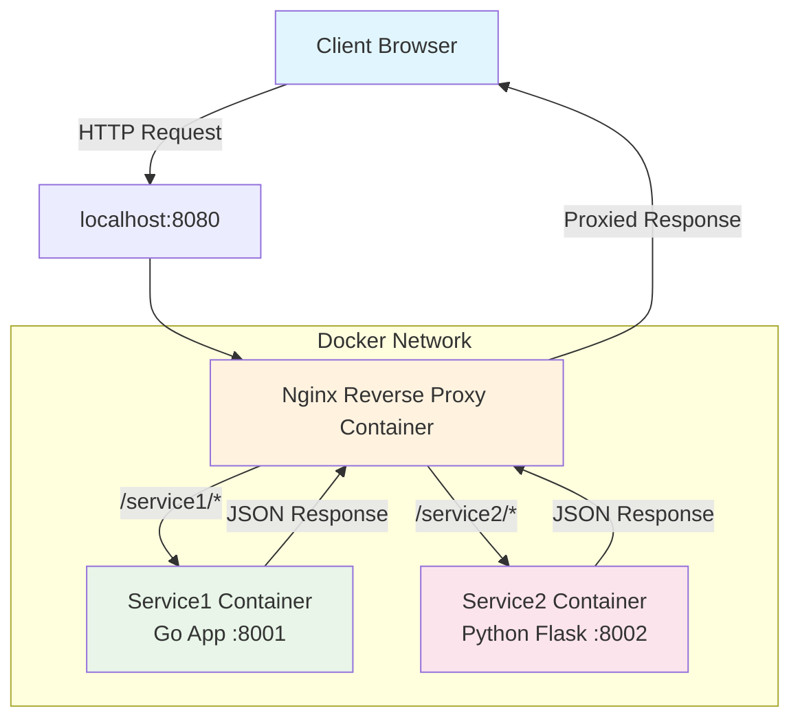

# System Architecture Workflow



## Request Flow Examples

### Service1 Request Flow
```
Client → localhost:8080/service1/ping 
      → Nginx (port 80) 
      → service1:8001/ping 
      → {"status":"ok","service":"1"}
```

### Service2 Request Flow  
```
Client → localhost:8080/service2/hello 
      → Nginx (port 80) 
      → service2:8002/hello 
      → {"message":"Hello from Service 2"}
```

## Container Communication
- **Network**: Docker bridge network
- **Service Discovery**: Container names (service1, service2, nginx)
- **Port Mapping**: Only nginx exposed to host (8080:80)
